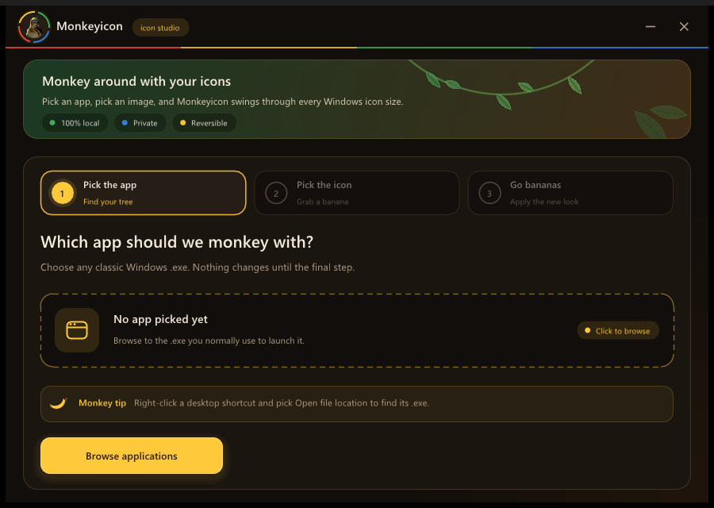

# Monkeyicon

Change the icon of any Windows app.

Pick an .exe, pick an image (PNG, JPG, BMP or ICO), and it builds every icon size Windows needs. There are two ways to apply it:

- **Safe launcher** makes a new shortcut with your icon. The app itself isn't touched.
- **Direct patch** swaps the icon inside the .exe. It makes a backup first (`app.exe.monkeyicon.bak`) and Restore puts it back. Close the app before patching. This breaks the file's signature and updates usually undo it, so it won't work on some apps (Store apps, anti-cheat games, anything that checks its own signature).

Everything stays on your PC. Generated icons go in `%LOCALAPPDATA%\Monkeyicon`.

If the taskbar still shows the old icon, unpin the app, launch it from the Monkeyicon shortcut in Start and pin that one instead.

## Install

Grab `Monkeyicon.exe` from [Releases](../../releases) and run it. Nothing else to install.

## Building

Needs Visual Studio 2022 or newer with the C++ desktop workload.

Open `Monkeyicon.sln`, set it to Release / x64 and build. The exe ends up in `x64\Release\`.

Uses [Dear ImGui](https://github.com/ocornut/imgui) (MIT), included in `third_party/imgui`.
